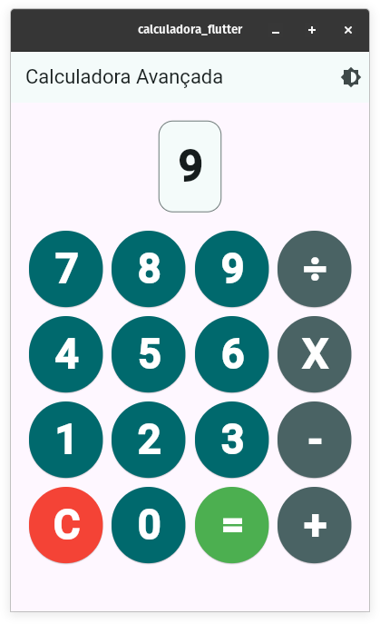
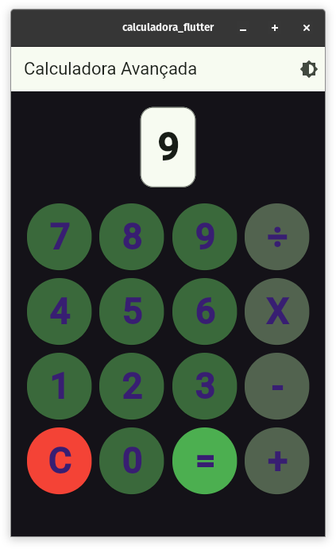

[](https://github.com/92username/calculadora-flutter/actions/workflows/dart.yml)
# Calculadora Flutter

Bem-vindo à **Calculadora Flutter**! Este projeto foi desenvolvido para explorar as funcionalidades do Flutter, criando uma calculadora simples, funcional e com uma interface moderna.

## 🎯 Objetivo

O objetivo deste projeto é demonstrar como criar uma aplicação em Flutter com:
- Interface intuitiva e responsiva.
- Funcionalidades matemáticas básicas, como adição, subtração, multiplicação e divisão.
- Estrutura modular para fácil manutenção e escalabilidade.

## 🚀 Funcionalidades

- Operações matemáticas básicas: soma, subtração, multiplicação e divisão.
- Interface responsiva e amigável.
- Suporte a dispositivos Android e iOS.

## 🛠️ Pré-requisitos

Antes de começar, você precisará ter instalado em sua máquina:

1. [Flutter SDK](https://docs.flutter.dev/get-started/install) (versão estável recomendada).
2. [Dart SDK](https://dart.dev/get-dart).
3. [Android Studio](https://developer.android.com/studio) ou [VSCode](https://code.visualstudio.com/) (para desenvolvimento e testes).
4. Dispositivo físico ou emulador para rodar a aplicação.

## 📦 Instalação

1. Clone o repositório para sua máquina local:
   ```bash
   git clone https://github.com/92username/calculadora-flutter.git
   cd calculadora-flutter
   ```

2. Instale as dependências do Flutter:
   ```bash
   flutter pub get
   ```

3. Certifique-se de que um dispositivo físico ou emulador está conectado:
   ```bash
   flutter devices
   ```

4. Execute a aplicação:
   ```bash
   flutter run
   ```
  > ⚠️ **Nota:** Este projeto foi testado apenas em ambientes Linux desktop. O comportamento em outros sistemas operacionais pode variar.

## 🖼️ Screenshots 
  




## 🗂️ Estrutura do Projeto

A estrutura do projeto segue a organização padrão do Flutter:

```
lib/
├── main.dart          # Arquivo principal
├── screens/           # Telas da aplicação
├── widgets/           # Componentes reutilizáveis
└── utils/             # Funções auxiliares (se houver)
```

## 📚 Recursos Adicionais

- [Documentação Oficial do Flutter](https://docs.flutter.dev/)
- [Documentação Oficial do Dart](https://dart.dev/guides)

## 🤝 Contribuições

Contribuições são sempre bem-vindas! Sinta-se à vontade para abrir issues ou enviar pull requests.

1. Faça um fork do projeto.
2. Crie sua branch com a nova funcionalidade:
   ```bash
   git checkout -b feature/nova-funcionalidade
   ```
3. Faça o commit das alterações:
   ```bash
   git commit -m 'Adiciona nova funcionalidade'
   ```
4. Envie suas alterações:
   ```bash
   git push origin feature/nova-funcionalidade
   ```
5. Abra um Pull Request.

## 📄 Licença

Este projeto está licenciado sob a [MIT License](LICENSE).

---

🌟 **Se você gostou deste projeto, não se esqueça de deixar uma estrela no repositório!**
```
